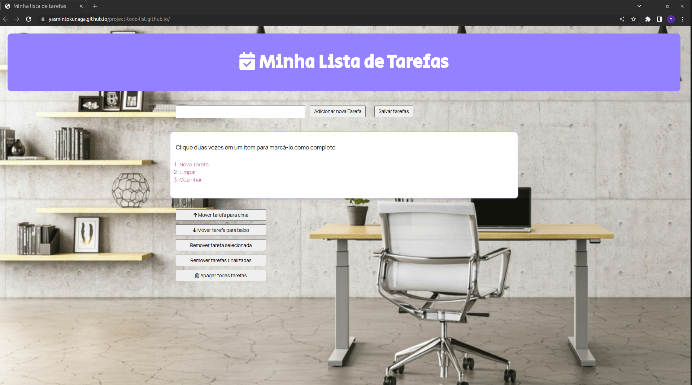

# Projeto To Do List

Projeto realizado durante o curso de Desenvolvimento Web na Trybe em Dezembro, 2022.

# Conhecimentos técnicos utilizados: 

* HTML, 
* CSS, 
* JavaScript (DOM, seletores, eventos, Local Storage).

# Objetivo: 

Construir uma página de organização de tarefas. 

# Requisitos:

* Input para adição de novas tarefas
* Incluir as tarefas em uma lista ordenadas
* Possibilidade de selecionar a tarefa ao clicar 1x com mouse
* Marcar a tarefa como concluída ao clicar 2x com o mouse
* Botões para subir ou rebaixar a tarefa na lista
* Botões para apagar: tarefa selecionada, tarefas concluídas, todas as tarefas
* Salvar a lista de tarefas no Local Storage.

# Resultado: 

